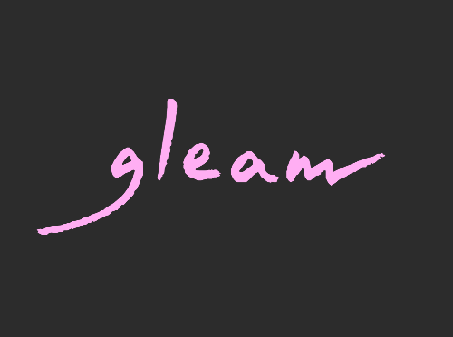

https://github.com/elixir-lang/elixir/blob/138c1bd9ed199a39f6b036230675e60ca6777cb5/lib/elixir/lib/inspect/algebra.ex#L623-L669

<p align="center">
  
</p>

<h1 align="center">
  Fast, friendly, functional!
</h1>

<p align="center">
  <a href="https://github.com/gleam-lang/gleam/releases"></a>
  <a href="https://webchat.freenode.net/#gleam-lang"></a>
  <a></a>
</p>


<!-- A spacer -->
<div>&nbsp;</div>

Gleam is a statically typed functional programming language for building
scalable concurrent systems. It compiles to [Erlang](http://www.erlang.org/)
and has straightforward interop with other BEAM languages such as Erlang,
Elixir and LFE.

It looks like this:

```rust
pub type Tree(value) {
  Leaf(value)
  Node(Tree(value), Tree(value))
};

pub fn any(tree: Tree(a), check: fn(a) -> Bool) -> Bool {
  case tree {
    Leaf(i) -> check(i)
    Node(left, right) -> any(left, check) || any(right, check)
  }
}

pub fn has_even_leaf(tree: Tree(Int)) -> Bool {
  any(tree, fn(i) {
    i % 2 == 0
  })
}
```

For more information see the Gleam website: [https://gleam.run](https://gleam.run).
