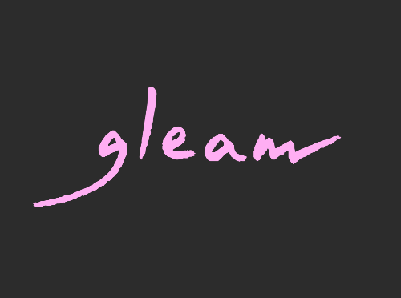

  

  
  
  
  

<!-- A spacer -->

&nbsp;

Gleam is a friendly language for building type-safe, scalable systems!

It compiles to [Erlang](http://www.erlang.org/) (or JavaScript) and has straightforward interop
with other BEAM languages such as Erlang, Elixir, and LFE.

For more information see the Gleam website: [https://gleam.run](https://gleam.run).

## Sponsors

Gleam is kindly supported by its sponsors. If you would like to support Gleam
please consider sponsoring its development [on GitHub](https://github.com/sponsors/lpil).

Thank you to our sponsors! Gleam would not be possible without you.

  

<!-- Below this line this file is autogenerated -->

 - [Adam Bowen](https://github.com/adamnbowen)
 - [Adam Brodzinski](https://github.com/AdamBrodzinski)
 - [Adi Iyengar](https://github.com/thebugcatcher)
 - [Alex Manning](https://github.com/rawhat)
 - [Alexander Koutmos](https://github.com/akoutmos)
 - [Ali Farhadi](https://github.com/farhadi)
 - [Anthony Scotti](https://github.com/amscotti)
 - [Arnaud Berthomier](https://github.com/oz)
 - [Arno Dirlam](https://github.com/arnodirlam)
 - [Ben Marx](https://github.com/bgmarx)
 - [Ben Myles](https://github.com/benmyles)
 - [Bernat Jufré Martínez](https://github.com/bjufre)
 - [Brian Glusman](https://github.com/bglusman)
 - [Bruno Michel](https://github.com/nono)
 - [Carlos Saltos](https://github.com/csaltos)
 - [Charles Chamberlain](https://github.com/charlesetc)
 - [Charlie Duong](https://github.com/charlieduong94)
 - [Chew Choon Keat](https://github.com/choonkeat)
 - [Chris Lloyd](https://github.com/chrislloyd)
 - [Chris Young](https://github.com/worldofchris)
 - [Christian Meunier](https://github.com/tlvenn)
 - [Christopher Keele](https://github.com/christhekeele)
 - [clangley](https://github.com/clangley)
 - [Clay](https://github.com/connorlay)
 - [Cole Lawrence](https://github.com/colelawrence)
 - [Colin](https://github.com/insanitybit)
 - [Copple](https://github.com/kiwicopple)
 - [Cristine Guadelupe](https://github.com/cristineguadelupe)
 - [Damir Vandic](https://github.com/dvic)
 - [Dan Dresselhaus](https://github.com/ddresselhaus)
 - [Dan Mueller](https://github.com/unthought)
 - [Dashuang Li](https://github.com/defp)
 - [Dave Lucia](https://github.com/davydog187)
 - [David Armstrong Lewis](https://github.com/davidarmstronglewis)
 - [David Bernheisel](https://github.com/dbernheisel)
 - [David Flanagan](https://github.com/rawkode)
 - [Dennis Tel](https://github.com/Eptis)
 - [Edon Gashi](https://github.com/edongashi)
 - [Elliott Pogue](https://github.com/epogue)
 - [Eric Meadows-Jönsson](https://github.com/ericmj)
 - [Erik Terpstra](https://github.com/eterps)
 - [Florian Kraft](https://github.com/floriank)
 - [fly.io](https://github.com/superfly)
 - [Gitpod](https://github.com/gitpod-io)
 - [Graeme Coupar](https://github.com/obmarg)
 - [Guilherme de Maio](https://github.com/nirev)
 - [Gustavo Villa](https://github.com/gfvcastro)
 - [Hayleigh Thompson](https://github.com/hayleigh-dot-dev)
 - [Henry Warren](https://github.com/henrysdev)
 - [Herdy Handoko](https://github.com/hhandoko)
 - [human154](https://github.com/human154)
 - [Ian González](https://github.com/Ian-GL)
 - [Ingmar Gagen](https://github.com/igagen)
 - [inoas](https://github.com/inoas)
 - [Ivar Vong](https://github.com/ivarvong)
 - [James MacAulay](https://github.com/jamesmacaulay)
 - [Jan Skriver Sørensen](https://github.com/monzool)
 - [Jechol Lee](https://github.com/jechol)
 - [jiangplus](https://github.com/jiangplus)
 - [Joe Corkerton](https://github.com/joecorkerton)
 - [John Doneth](https://github.com/JohnDoneth)
 - [John Gallagher](https://github.com/johngallagher)
 - [John Palgut](https://github.com/Jwsonic)
 - [Jonathan Arnett](https://github.com/J3RN)
 - [josh rotenberg](https://github.com/joshrotenberg)
 - [José Valim](https://github.com/josevalim)
 - [Josías Alvarado](https://github.com/pointerish)
 - [João Veiga](https://github.com/jveiga)
 - [Julien D](https://github.com/silicium14)
 - [Justin Blake](https://github.com/blaix)
 - [Kapp Technology](https://github.com/kapp-technology)
 - [kee-oth](https://github.com/kee-oth)
 - [Kieran Gill](https://github.com/kierangilliam)
 - [Lars Lillo Ulvestad](https://github.com/kodeFant)
 - [Lars Wikman](https://github.com/lawik)
 - [Marcel Lanz](https://github.com/marcellanz)
 - [Marcin Puc](https://github.com/tranzystorek-io)
 - [Marius Kalvø](https://github.com/mariuskalvo)
 - [Mark Holmes](https://github.com/markholmes)
 - [Mark Markaryan](https://github.com/markmark206)
 - [Markus](https://github.com/markusfeyh)
 - [Martin Janiczek](https://github.com/Janiczek)
 - [Mathias Jean Johansen](https://github.com/majjoha)
 - [Matt Van Horn](https://github.com/mattvanhorn)
 - [Michael Anhari](https://github.com/anhari)
 - [Michael Chris Lopez](https://github.com/mcchrish)
 - [Michael Jones](https://github.com/michaeljones)
 - [Michał Kowieski](https://github.com/utevo)
 - [Michele Riva](https://github.com/micheleriva)
 - [Mike Lapping](https://github.com/mlapping)
 - [Mike Roach](https://github.com/mroach)
 - [Milton Mazzarri](https://github.com/milmazz)
 - [Nathaniel Knight](https://github.com/nathanielknight)
 - [Nick Reynolds](https://github.com/ndreynolds)
 - [Nicklas Sindlev Andersen](https://github.com/NicklasXYZ)
 - [NineFX](http://www.ninefx.com)
 - [OldhamMade](https://github.com/OldhamMade)
 - [Ole Michaelis](https://github.com/OleMchls)
 - [Oliver Searle-Barnes](https://github.com/opsb)
 - [Parker Selbert](https://github.com/sorentwo)
 - [Pete Jodo](https://github.com/petejodo)
 - [Peter Saxton](https://github.com/CrowdHailer)
 - [porkbrain](https://github.com/bausano)
 - [Praveen Perera](https://github.com/praveenperera)
 - [qingliangcn](https://github.com/qingliangcn)
 - [Quinn Wilton](https://github.com/QuinnWilton)
 - [Raúl Chouza ](https://github.com/chouzar)
 - [Redmar Kerkhoff](https://github.com/redmar)
 - [Reio Piller](https://github.com/hypno2000)
 - [Reto Kramer](https://github.com/ret)
 - [Ryan Winchester](https://github.com/ryanwinchester)
 - [Sam Aaron](https://github.com/samaaron)
 - [Sascha Wolf](https://github.com/sascha-wolf)
 - [Saša Jurić](https://github.com/sasa1977)
 - [Scott Wey](https://github.com/scottwey)
 - [Sean Jensen-Grey](https://github.com/seanjensengrey)
 - [Sebastian Porto](https://github.com/sporto)
 - [Sebastian Ziemann](https://github.com/corka149)
 - [Shane Sveller](https://github.com/shanesveller)
 - [Shunji Lin](https://github.com/shunjilin)
 - [Shuqian Hon](https://github.com/honsq90)
 - [Simone Vittori](https://github.com/simonewebdesign)
 - [SkunkWerks GmbH](https://skunkwerks.at/)
 - [SmartLogic](https://github.com/smartlogic)
 - [Strand Communications](https://github.com/strandcom)
 - [Terje Bakken](https://github.com/terkiterje)
 - [Tim Buchwaldt](https://github.com/timbuchwaldt)
 - [Tomasz Kowal](https://github.com/tomekowal)
 - [Tomochika Hara](https://github.com/thara)
 - [Tristan de Cacqueray](https://github.com/TristanCacqueray)
 - [Tristan Sloughter](https://github.com/tsloughter)
 - [Uku Taht](https://github.com/ukutaht)
 - [Vincent Le Goff](https://github.com/vincent-lg)
 - [WeiZheng Liu](https://github.com/weizhengliu)
 - [Will Ricketts](https://github.com/willricketts)
 - [Wilson Silva](https://github.com/wilsonsilva)
 - [Wojtek Mach](https://github.com/wojtekmach)
 - [YourMother-really](https://github.com/YourMother-really)
 - [Yu Matsuzawa](https://github.com/ymtszw)
 - [Štefan Ľupták](https://github.com/stefanluptak)
